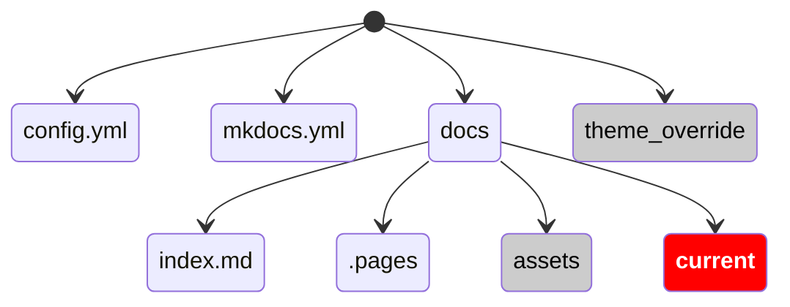
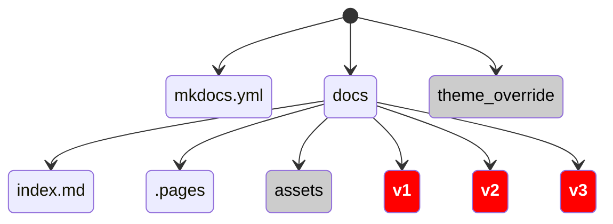

# mkdocs-preprocessor

Make documentation versions painless with MKDocs

## Problem statement

Documentation needs to cover multiple software versions. A large number of pages apply to all versions and should be maintained in a single source. Some pages exists only for some versions, some have version specific sections. Users need to able to switch between versions.

## Source Directory Structure



## Target Directory Structure



## Front Matter

On top of each markdown document generated in one of the version paths you will find this front-matter (plus eventual existing front matter)

```yaml
this_version: v1
all_versions:
  - v1
  - v2
  - v3
```

## Configuration

The pre-processor needs a `yaml` file to configure its run:

```yaml
source: /source # directory with source files
target: /target # directory for output, files will be overwritten here
all_versions: # list of versions to generate, simple or semantic
  - v1
  - v2
generate_redirects: true # Should redirect files be created in directory without version number
```

- Version can be simple `v1`, or semantic `v1.1` or `v1.0.2`

## How it works

- scans the source sub-directory with the name `current` for files and copies them to the version directories
- on copy markdown files are inspected for front-matter to determine what versions will have that page
- the front-matter gets updated to reflect version specific info
- if a file changes between versions, we use file name versioning. so `info.md`, `info.v1.md` and `info.v2.md` are considered the same file for different versions
- The first version a file appears is determined by the file name `index.md` or `index.v1.md` will be in all versions. `demo.v4.1.md` will only appear in version 4.1 and higher
- You can limit the versions a page will appear using front-matter:

  ```yaml
  max_version: v2
  ```

  will only appear in v1 and v2

- `.pages` files are handled similarly `v3.pages` will replace `.pages` in v3 onwards

## Caveats

- You want to use the `awesome-pages` plugin to make use of `.pages` navigation structure
- for the automatic redirect, you must disable thw `navigation.instant` feature. It is not compatible with the redirect meta statement
- you need a template `versionredirect.html` like in the `theme_overrides` direcory in this repo

## Docker use

Pull the version matching your hardware

```bash
# Intel / Amd 64Bit
docker pull ghcr.io/hcl-tech-software/mkdocs:latest
# Arm 64 Bit (e.g M1/M2/M3 macOS)
docker pull ghcr.io/hcl-tech-software/mkdocs:M1
```

### Map the directories

- source: directory location where your `mkdocs.yml` and `docs` can be found
- docs: output directory for the transformed content
- site: destination of the final rendered site

### Launch samples

The following section shows options to launch the image with options

#### Standard edit, no version handling

```bash
# Your current directory has regular mkdocs files
docker run --rm -it -p 8000:8000 \
           -v ${PWD}:/docs \
           docker.qs.hcllabs.net/hclcom/mkdocs
```

#### Version preprocessing only

```bash
# Your current directory has mkdocs to be preprocessed
# and the result outputs to target
docker run --rm -it -p 8000:8000 \
           -v ${PWD}/target:/docs \
           -v ${PWD}/source:/source \
           docker.qs.hcllabs.net/hclcom/mkdocs versions
```

#### Preprocess & Edit

```bash
# Your current directory has mkdocs to be preprocessed
# and the result outputs to target
docker run --rm -it -p 8000:8000 \
           -v ${PWD}/target:/docs \
           -v ${PWD}/source:/source \
           docker.qs.hcllabs.net/hclcom/mkdocs versions watch
```

### Preprocess and Render (e.g. in GitHub Action)

```bash
# Your current directory has mkdocs to be preprocessed
# and the result outputs to target
docker run --rm -it -p 8000:8000 \
           -v ${PWD}/target:/docs \
           -v ${PWD}/source:/source \
           -v ${PWD}/site:/site \
           docker.qs.hcllabs.net/hclcom/mkdocs site
```
